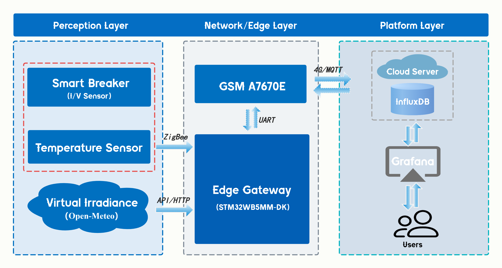

# IoT-based PV Monitoring System

A smart photovoltaic monitoring system with Performance Ratio (PR) based fault detection and remote breaker control, built for MSc thesis at Cyprus University of Technology.

## System Architecture



```
PV Panel → Inverter (DC→AC) → Breaker (TOWSMR1-40)
  → Zigbee (0xEF00) → STM32WB5MM-DK → LPUART1
  → A7670E (4G LTE) → MQTT (broker.emqx.io:1883)
  → Node-RED → InfluxDB → Grafana

Remote Control (downstream):
  Dashboard → MQTT → A7670E → STM32 → Zigbee → Breaker ON/OFF
```

## Features

- Real-time power monitoring (voltage, current, power, temperature)
- Performance Ratio fault detection with 4-level classification
- Remote breaker ON/OFF control via MQTT
- 50-device simulator for scalability testing (5 cities across Cyprus)
- GHI-based irradiance matching (8-grid-point coverage via Open-Meteo API)
- PostgreSQL device registry with automatic Node-RED synchronization
- Alert system with 30-minute cooldown per device per rule

## Tech Stack

| Layer | Technology |
|-------|-----------|
| Edge Gateway | STM32WB5MM-DK (Cortex-M4 + M0+ for Zigbee) |
| 4G Communication | A7670E LTE Cat-1 Module |
| Smart Breaker | TOWSMR1-40 (Zigbee, Tuya Protocol) |
| Protocol | MQTT (QoS 0) + Zigbee 3.0 (Cluster 0xEF00) |
| Data Processing | Node-RED |
| Time-series DB | InfluxDB 2.7 (Flux query language) |
| Relational DB | PostgreSQL 15 (device registry) |
| Visualization | Grafana (7 dashboard panels) |
| Deployment | Docker Compose |

## Requirements

### Hardware
| Device | Model | Purpose |
|--------|-------|---------|
| Edge Gateway | STM32WB5MM-DK (MB1292) | Zigbee Coordinator + data processing |
| 4G Module | SIMCom A7670E | LTE Cat-1 MQTT communication |
| Smart Breaker | TOWSMR1-40 (Zigbee) | Voltage/current sensing + remote switch |
| 4G Antenna | Wideband SMA antenna | External antenna for A7670E |
| SIM Card | Any 4G data SIM | Mobile network connectivity |
| Jumper Wires | Female-to-female × 3 | PB5→RXD, PC0→TXD, GND |
| USB Cables | Micro-USB × 2 | Power for STM32 and A7670E |

### Software
| Software | Version | Purpose |
|----------|---------|---------|
| Docker Desktop | 20.10+ | Containerized dashboard deployment |
| STM32CubeIDE | 1.13+ | Firmware compilation and flashing |
| Git | 2.30+ | Repository management |

### Operating System
- **Dashboard server:** Windows 10+, Ubuntu 20.04+, or macOS (Docker required)
- **Firmware development:** Windows 10+ (STM32CubeIDE)
- **Minimum specs:** Dual-core CPU, 4GB RAM, 10GB disk space

## Lab Test Results

| Metric | Voltage | Current | Power |
|--------|---------|---------|-------|
| Mean Error (>50W) | 0.13% | 0.77% | 0.69% |
| Max Error (>50W) | 0.18% | 2.48% | 1.81% |

| Metric | Value |
|--------|-------|
| STM32 LCD response time | 10.2s avg |
| Grafana cloud response time | 19.2s avg |
| Remote control (breaker trip) | 0.48s avg |
| Remote control (breaker close) | 0.51s avg |

## Repository Structure

```
pv-iot-project/
├── README.md
├── docs/
│   ├── install-stm32.md          # STM32 firmware installation guide
│   ├── install-dashboard.md      # Dashboard setup guide (Docker)
│   ├── custom-server.md          # Custom MQTT server & portability guide
│   ├── PV_Project_Handoff_v4.md  # Project documentation
│   └── device_management_guide.md
├── stm32-firmware/
│   ├── README.md                 # How to open, configure, build and flash
│   ├── a7670e.h                  # A7670E driver header
│   ├── a7670e.c                  # A7670E driver (MQTT state machine)
│   └── app_zigbee.c              # Zigbee application (control callback)
├── dashboard/
│   ├── docker-compose.yml
│   ├── flows.json                # Node-RED flows export
│   ├── grafana-dashboard.json    # Grafana dashboard export
│   └── insert_devices.sql        # 50 simulated devices SQL
├── hardware/
│   ├── wiring_diagram.pdf
│   └── photos/
├── thesis/
│   ├── figures/
│   └── data/
└── nodered/
    ├── device-registry-flow.json
    └── remote-control-flow.json
```

## Quick Start

1. **Clone the repository**
   ```bash
   git clone https://github.com/csmdqq-source/pv-iot-project.git
   cd pv-iot-project
   ```

2. **Start the dashboard** (requires Docker)
   ```bash
   cd dashboard
   docker-compose up -d
   ```

3. **Flash STM32 firmware** → See [docs/install-stm32.md](docs/install-stm32.md)

4. **Configure the dashboard** → See [docs/install-dashboard.md](docs/install-dashboard.md)

5. **Custom MQTT server** → See [docs/custom-server.md](docs/custom-server.md)

## Author

**Tian Qiyuan** — MSc Electronic Information
- Cyprus University of Technology (Supervisor: Prof. Petros Aristidou)
- Hangzhou Dianzi University
